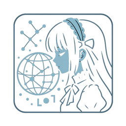
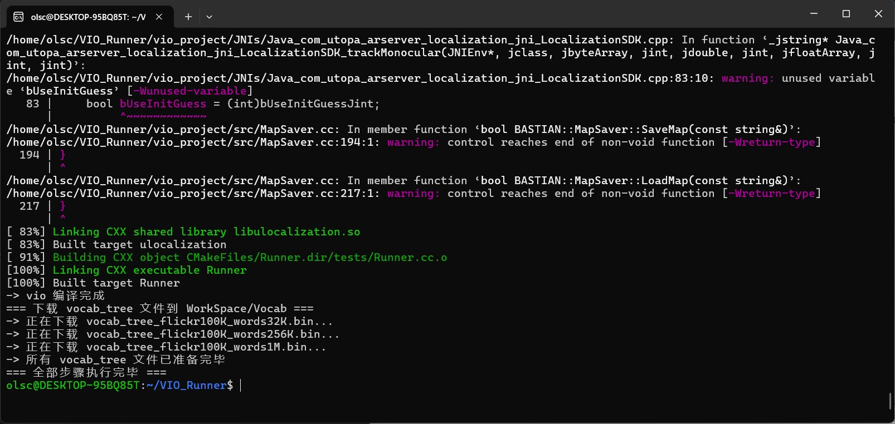
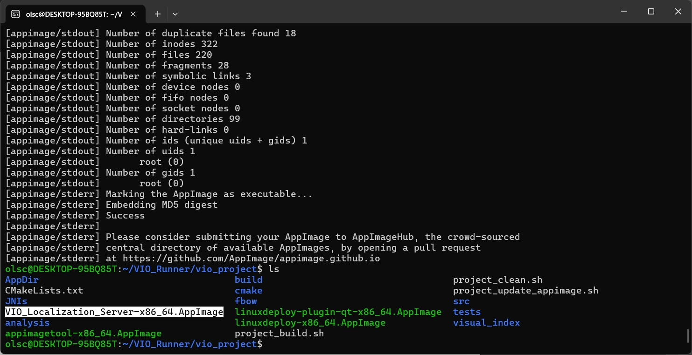

[中文](README.md)  [日本語](README_ja.md)

# ✨ 🔮 ✨ **《Space Magic · Upper-Mid Tier Scroll》** ✨ 🔮 ✨

\<div align="center"\>
  \
  \<br\>
  \<h2\>✧･ﾟ\* The Arcane Secrets of Spatial Magic \*･ﾟ✧\</h2\>
\</div\>

-----

## 📜 **Chapter 1: The Hierarchical Mysteries of Spatial Magic** 🌌

In the mystical world, various forms of magic shine like stars, yet are as unfathomable as the abyss. Among them, 『Spatial Magic』 is a brand new discipline meticulously crafted by humanity to enable mechanical arks to comprehend the reality of the world. Based on its depth and mastery, people have divided it into the following realms:

### ⚡ **Low-Tier Magic:** 🧙‍♂️💫

   - 🔍 **Spell Medium:** Requires the aid of ancient "Magic Circles" (magical patterns generated from incantation) to anchor spatial coordinates.
   - 🌟 **Magical Manifestation:** Capable of summoning or placing illusory creations, allowing them to faithfully follow the pose direction of "Marker Images" as if guided by invisible threads.

✦ Mages or magical orders that have reached this stage (due to the large number, only a few are listed here):

> For example: [zappar-xr](https://github.com/zappar-xr), [AR.js](https://github.com/jeromeetienne/AR.js), etc.

### ⚡⚡ **Lower-Mid-Tier Magic:** 🌌✨

   - 🔍 **Spell Advancement:** Still relies on "Magic Circles" (magical patterns generated from incantation) to determine spatial orientation.
   - 🌟 **Magical Solidification:** However, magic at this stage has begun to awaken stronger powers\! With the aid of gravity magic (such as a type called 6dof gravity magic), once illusory objects are anchored by "Marker Images," they no longer dissipate like bubbles. Even if you traverse through space, they can miraculously remain in their initial manifestation location.

### ⚡⚡⚡ **Mid-Tier Magic:** 👁️🌠

   - 🔍 **Perception Domain:** Modern mages begin to utilize vision or other diverse senses, as if possessing a third eye that perceives all things, to recognize and sense the surrounding space.
   - 🌟 **Pose Insight:** They can precisely locate their own pose (camera) in the real world and cleverly integrate the coordinates of the illusory world with the real world. Thus, magical creations can emerge in real space, lifelike and vivid.

✦ Mages or magical orders that have reached this stage (fewer in number):

> For example: [Hierarchical-Localization](https://github.com/cvg/Hierarchical-Localization), etc.

### ⚡⚡⚡⚡ **Upper-Mid-Tier Magic:** 🚀🌟

   - 🔍 **Perception Leap:** This level of magic is even swifter and more powerful\! Through vision or other arcane means, mages can instantly perceive space and capture their own orientation.
   - 🌟 **Robust Manifestation:** The fusion of the illusory and real worlds is as rapid and stable as lightning. Magical creations manifest in the real world with stronger "robustness," less susceptible to interference and dissipation.

✦ Mages or magical orders that have reached this stage (currently achieved well by non-open-source projects):

> For example: [EasyAR](https://help.easyar.cn/EasyAR%20Sense/v4_3/Guides/EasyAR-Sparse-Spatial-Map.html).

### ⚡⚡⚡⚡⚡ **High-Tier Magic:** 🦉🌃☀️

   - 🔍 **Global Insight:** Mages who master such magic possess a gaze that transcends time and space, capable of understanding the directional relationships of the entire space. Even more astonishing is their ability to eliminate the influence of temporal shifts brought about by time (the alternation of day and night) and seasons (the cycle of the four seasons).
   - 🌟 **Eternal Anchoring:** No matter how the external world changes, they can precisely locate themselves and perfectly intertwine the illusory realm with the real world, allowing magical creations to exist eternally in their designated positions.

✦ No mages have yet reached this level. Only some astronomical devices requiring special hardware support can roughly achieve similar effects.

> \~\~(Among which GPS (VPS) is one way to circumvent the limitations, and some other methods are still under research.)\~\~

-----

### **✨ Additional Gifts of Advanced Study (Innate Talents):** 🎁

As your mastery of spatial magic deepens, you may unexpectedly unlock the following fascinating talents:

1.  **🧠 Auxiliary Brain (Artificial Intelligence):**
    💡 Your mind will connect with an intelligent force that nearly possesses independent consciousness. It will act as your loyal magical assistant, providing you with endless computational and analytical power, which you can use to determine current pose information (such as [hloc](https://github.com/cvg/Hierarchical-Localization)).

2.  **🗺️ Spatial Scanning (such as SLAM):**
    📡 You will possess the ability to map the world as if drawing a global chart, capable of scanning and constructing precise models of the surrounding space, as if you have gained eyes that can recognize space.

-----

### **📚 Ancient Terms in Magical Texts (Special Nomenclature):** 🏺

In studying the ancient texts of spatial magic, you may encounter the following powerful words:

1.  **🎨 Graphics:**
    🖼️ An ancient discipline studying how to use magic to create, render, and manipulate images in the void.

2.  **🗝️ SIFT (Scale-Invariant Feature Transform):**
    🔍 A mysterious magical incantation used to identify unique magical feature points in space under different scales and rotations.

3.  **🧳 Bag of Words (BoW):**
    📚 A magical container used to store and retrieve "vocabulary" of spatial features, helping mages quickly recognize scenes.

4.  **📐 PnP (Perspective-n-Point):**
    📍 An ancient geometric magic used to deduce the pose of the mage (camera) through known N three-dimensional spatial points and their projections in a two-dimensional image.

-----

\<div align="center"\>
  \
  \<br\>
  \<h2\>⚜️ A Guide to Magical Practice ⚜️\</h2\>
\</div\>

## 📖 **Chapter 2: Preparing the Ritual to Initiate Spatial Magic** 🧪

To successfully cast powerful spatial magic, you need to carefully prepare the initiation environment and rely on mystical magic scrolls.

### **⚙️ Magical Hardware and Arcane Systems** 🛠️

   - **💻 Magical Core:**
   Requires a relatively recent Central Processing Unit (CPU), which will serve as the powerful mental support for your casting.

   - **🖥️ Visual Conductor:**
   Also requires a powerful Nvidia Graphics Processing Unit (GPU), which will drive the rendering of magical visuals.

   - **🐧 Arcane System:**
   Currently, only the ancient Ubuntu 20.04 operating system is considered the most compatible ground for spatial magic.

### **📜 Using Magic Scrolls to Automatically Chant Spells** ✨

   - **✧ Initiation Spell:** Execute the ancient command-line spell:
     ```bash
     bash install_vio.sh
     ```
   - **⚠️ Important Note\!** 🧙‍♂️🚫 Remember, do not execute this spell under the guise of "sudo" to avoid disturbing the harmony of space.
   - **✅ Ritual Completion:** After the spell is executed, the magical environment will be automatically configured, and the relevant magical energy will be compiled and condensed.
   - **📍 Location of Magical Creations:** The compiled magical energy will be hidden as binary files in `VIO_Runner/build/Runner` and `VIO_Runner/build/Client` under the current directory.

### **📥 Using Additional Magic Scrolls to Summon the AppImage Environment** 🔮

   - **➡️ Journey to the Magical Realm:** Enter the folder named `VIO_Runner`.
   - **✧ Summoning Spell:** Execute the spell on the following magic scroll:
     ```bash
     bash project_update_appimage.sh
     ```
   - **🌈 Environment Descends:** The magic scroll will automatically download the AppImage environment for you, providing an independent magical operating space.

### **📦 Using Additional Magic Scrolls to Compile and Seal the AppImage** 🧙‍♀️

   - **➡️ Delve Deeper into the Magical Realm:** Also enter the `VIO_Runner` folder.
   - **✧ Sealing Spell:** Execute the following ancient spell:
     ```bash
     bash project_build.sh
     ```
   - **💪 Power Condenses:** This spell will automatically compile and package your magical energy, sealing it into an AppImage file for easy portability and dissemination.

### **🧹 Using Additional Magic Scrolls to Purify the Magical Realm** ✨

   - **➡️ Return to the Magical Realm:** Re-enter the `VIO_Runner` folder.
   - **✧ Purification Spell:** Execute the following purification spell:
     ```bash
     bash project_clean.sh
     ```
   - **✨ Realm Cleansed:** This spell will automatically clean up residual magical traces in the environment directory, maintaining the cleanliness of the enchanted realm.

### **🌏 How to Create a Magical Enclosure** 🔮

\<div align="center"\>
  \
\</div\>

   - 🚶‍♂️ Step into the ancient realm of the `colmap` folder.
   - 📸 Place the image fragments containing the shadows of the world you need to build into the sacred container of the `images` folder.
   - ✨ Chant a new creation spell:

   ```bash
   bash colmap_build.sh
   ```

   - 🌌 If the virtual world takes shape, the contours of the world will appear in a miraculous form:

\<div align="center"\>
  \
\</div\>

   - 👁️ If you wish to gaze again at the stardust condensed by magic, recite this spell:

   ```bash
   bash colmap_view.sh
   ```

### **🚀 How to Initiate Magic** 🔮

Re-enter the realm of the `vio_project` folder:

✧ Create the map file `VocIndex.bin` to inscribe the world index:

```bash
./VIO_Localization_Server-x86_64.AppImage index ../colmap/database.db ../colmap/sparse/ VocIndex.bin ~/WorkSpace/Vocab/vocab_tree_flickr100K_words1M.bin
```

✧ Launch the server:

```bash
./VIO_Localization_Server-x86_64.AppImage server ../colmap/database.db ../colmap/sparse/ VocIndex.bin 8080
```

✧ [Alternative] Create another virtual map `SavedMap.dat`:

```bash
./VIO_Localization_Server-x86_64.AppImage save ../colmap/database.db ../colmap/sparse/ SavedMap.dat keyframes.txt
```

✧ Test the server:

```bash
./Client 127.0.0.1 8080 ./images/output_0001.jpg 240
```

The incantation method is: IP address + port number + image address + the focal length data corresponding to this image.

\<div align="center"\>
  \
\</div\>

-----

\<div align="center"\>
  \
  \<br\>
  \<h2\>🏆 Acknowledgements and References 🏆\</h2\>
\</div\>

## ✨ **Chapter 3: Acknowledgements** 🙏

We sincerely thank the following great souls whose light of wisdom has illuminated our path in exploring spatial magic:

💫 Thanks to the original author of this project: yeliu@deepmirror.com

**🔗 Links to Related Magical Literature:** 📖

  - [🌟 Detailed Explanation of Spatial Magic](https://vio.readthedocs.io/zh-cn/latest/)
  - [💻 Source of Original Magical Code (from gggliuye)](https://github.com/gggliuye/VIO/tree/79f802da26dabdfc3ec7bfa4a871da0c1a2ea165)
  - [🏰 colmap (Version 3.6 used in this project)](https://colmap.github.io/)
  - [👜 FBoW](https://github.com/rmsalinas/fbow)
  - [🚩 SIFT (1999)](http://www.cs.ubc.ca/~lowe/papers/iccv99.pdf)
  - [🚩 SIFT (2004)](http://www.cs.ubc.ca/~lowe/papers/ijcv04.pdf)

-----

\<div align="center"\>
  \<h3\>✧May this upper-mid-tier scroll guide you to continuously improve in the wondrous journey of spatial magic and discover deeper mysteries✧\</h3\>
  \<p\>🧙‍♂️ ✨ 🌌 ✨ 🔮\</p\>
\</div\>

\<div align="center"\>
  \
\</div\>

-----

[Usage requires adherence to this magical license, click to view](LICENSE)