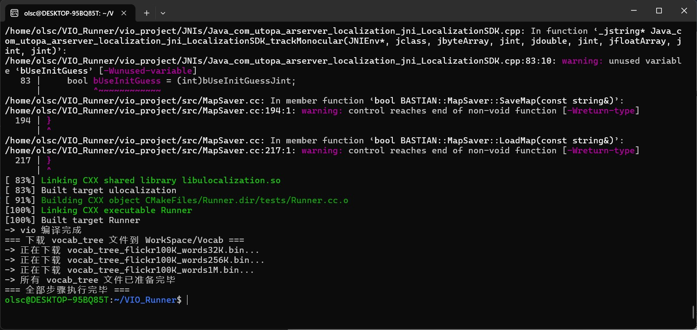

[中文](README.md)  [English](README_en.md)

# ✨ 🔮 ✨ **《空間魔法・中高階巻軸》** ✨ 🔮 ✨

\<div align="center"\>
  \
  \<br\>
  \<h2\>✧･ﾟ\* 空間魔法秘典 \*･ﾟ✧\</h2\>
\</div\>

-----

## 📜 **第一章：空間魔法の階層奥義** 🌌

神秘的な世界において、様々な魔法は星々のように輝き、深淵のように測り知れません。その中でも『空間魔法』は、人が機械の魔盒に現実世界を理解させるために、丹精込めて創造した全く新しい魔法です。その精深さによって、人はこれを以下の領域に分類しました。

### ⚡ **低階魔法：** 🧙‍♂️💫

   - 🔍 **呪文媒体：** 古の「魔法陣」（詠唱によって生じる魔法陣の図案）を借りて空間座標を固定する必要があります。
   - 🌟 **魔法顕現：** 虚ろな創造物を召喚または配置し、それが無形の糸に引かれるかのように、「Marker図」の姿勢方向を忠実に追従させることができます。

✦ この段階に達した魔法使いまたは魔法使いの集団（数が多いため、ここではいくつかの例のみを示します）：

> 例えば：[zappar-xr](https://github.com/zappar-xr)、[AR.js](https://github.com/jeromeetienne/AR.js) など。

### ⚡⚡ **中低階魔法：** 🌌✨

   - 🔍 **呪文進階：** 同様に「魔法陣」（詠唱によって生じる魔法陣の図案）に依存して空間方位を決定します。
   - 🌟 **魔法固化：** しかし、この段階の魔法はより強い力を初步的に覚醒させています！重力魔法（例えば6dofと呼ばれる一種の重力魔法）を借りることで、虚ろな物は一旦「Marker図」に固定されると、泡のように消散することはありません。たとえ空間を移動しても、それらは最初に現れた場所に奇跡的に留まります。

### ⚡⚡⚡ **中階魔法：** 👁️🌠

   - 🔍 **感知領域：** 現代の魔法使いは、視覚または他の多元的な感覚を用いて、万物を見通す第三の眼を持つかのように、周囲の空間を認識し、感知し始めます。
   - 🌟 **姿勢洞察：** 彼らは現実世界における自身の姿勢（カメラ）を正確に特定し、その虚ろな世界の座標を現実世界と巧みに融合させることができます。こうして、魔法の創造物は現実の空間に生き生きと現れるのです。

✦ この段階に達した魔法使いまたは魔法使いの集団（数は少ない）：

> 例えば：[Hierarchical-Localization](https://github.com/cvg/Hierarchical-Localization) など。

### ⚡⚡⚡⚡ **中高階魔法：** 🚀🌟

   - 🔍 **感知飛躍：** この等級の魔法はより迅速かつ強力です！視覚または他の奥義的な手段を通じて、魔法使いは瞬時に空間を洞察し、自身の位置を捉えることができます。
   - 🌟 **ロバスト顕現：** 虚ろな世界と現実世界の融合は稲妻のように速く、安定しており、魔法の創造物は現実世界に現れ、より強い「ロバスト性」を持ち、干渉を受けにくく消散しにくいです。

✦ この段階に達した魔法使いまたは魔法使いの集団（現在比較的良く達成しているのは未公開プロジェクト）：

> 例えば：[EasyAR](https://help.easyar.cn/EasyAR%20Sense/v4_3/Guides/EasyAR-Sparse-Spatial-Map.html)。

### ⚡⚡⚡⚡⚡ **高階魔法：** 🦉🌃☀️

   - 🔍 **全域洞察：** このような魔法を掌握する魔法使いは、その眼差しが時空を超える星々のように、空間全体の方向関係を理解することができます。さらに驚くべきことに、彼らは時間（昼夜の移り変わり）と季節（四季の移り変わり）がもたらす時空の変化の影響さえ排除することができます。
   - 🌟 **永遠固定：** 外界がどのように変化しようとも、彼らは自身の位置を正確に特定し、虚ろな世界と現実世界を完璧に織り交ぜ、魔法の創造物を定められた場所に永遠に存在させることができます。

✦ 現在、この境地に達することができる魔法使いはいません。ごく一部の天文分野で特殊なハードウェアのサポートを必要とする機器が、おおよそ同様の効果を達成しています。

> \~\~(その中でGPS（VPS）はそのような抜け道の一つであり、他にもいくつかの抜け道が研究されています。)\~\~

-----

### **✨ 進階研究の追加の贈り物 (天賦の才能)：** 🎁

あなたの空間魔法の修為が日増しに深まるにつれて、以下のような魅惑的な天賦の才能を予期せず解き放つかもしれません。

1.  **🧠 補助脳 (人工知能)：**
    💡 あなたの思考は、独立した意識に近い知的能力と結びつき、それはあなたの忠実な魔法助手のように、無限の計算と分析能力を提供します。あなたはそれを利用して、現在の姿勢情報（例えば [hloc](https://github.com/cvg/Hierarchical-Localization)）を判断することができます。

2.  **🗺️ 空間スキャン (SLAMなど)：**
    📡 あなたは世界地図を描くかのような能力を持ち、周囲の空間をスキャンして正確なモデルを構築することができます。まるで空間を認識できる眼を手に入れたかのようです。

-----

### **📚 魔法典籍における古の言葉 (特殊な用語)：** 🏺

空間魔法の研究における古の典籍の中で、あなたは以下のような力強い言葉に出会うかもしれません。

1.  **🎨 グラフィックス (Graphics)：**
    🖼️ 虚空に魔法を用いて画像を創造、レンダリング、操作する方法を研究する古の学問。

2.  **🗝️ SIFT (スケール不変特徴変換)：**
    🔍 異なるスケールと回転角度の下で、空間内の独特な魔法の特徴点を識別するための神秘的な魔法の呪文。

3.  **🧳 Bag of Words (BoW)：**
    📚 空間の特徴の「語彙」を保存および検索するための魔法に満ちた容器。魔法使いがシーンを迅速に識別するのに役立ちます。

4.  **📐 PnP (Perspective-n-Point)：**
    📍 既知のN個の三次元空間点とその二次元画像における投影を通じて、魔法使い（カメラ）の姿勢を逆推定するための古の幾何学的な魔法。

-----

\<div align="center"\>
  \
  \<br\>
  \<h2\>⚜️ 魔法実践指南 ⚜️\</h2\>
\</div\>

## 📖 **第二章：空間魔法の起動儀式を調製する** 🧪

強力な空間魔法を成功させるためには、起動する環境を注意深く準備し、神秘的な魔法巻物を借りる必要があります。

### **⚙️ 魔法ハードウェアと奥術システム** 🛠️

   - **💻 魔法中枢：**
   比較的新しい中央処理装置 (CPU) が必要です。それはあなたの呪文詠唱の強力な脳のサポートとなります。

   - **🖥️ 視覚魔導器：**
   強力なNvidia製グラフィックプロセッサ (GPU) も必要です。それは魔法の視覚表現を駆動します。

   - **🐧 奥術システム：**
   現在、古代のUbuntu 20.04オペレーティングシステムのみが、空間魔法と最も適合する土壌であると考えられています。

### **📜 魔法巻物を使用して自動的に呪文を詠唱する** ✨

   - **✧ 起動呪文：** 古代のコマンドライン呪文を実行します：
     ```bash
     bash install_vio.sh
     ```
   - **⚠️ 重要な注意！** 🧙‍♂️🚫 空間の調和を乱さないように、「sudo」の名の下にこの呪文を実行しないでください。
   - **✅ 儀式完了：** 呪文の実行が完了すると、魔法環境は自動的に構成され、関連する魔法エネルギーがコンパイルされ凝縮されます。
   - **📍 魔法の創造物の所在地：** コンパイルされた魔法エネルギーは、現在のディレクトリ下の `VIO_Runner/build/Runner` と `VIO_Runner/build/Client` にバイナリファイルとして隠されています。

### **📥 追加の魔法巻物を使用してAppImage環境を召喚する** 🔮

   - **➡️ 魔法領域へ向かう：** `VIO_Runner` という名前のフォルダに入ります。
   - **✧ 召喚呪文：** 以下の魔法巻物に書かれた呪文を実行します：
     ```bash
     bash project_update_appimage.sh
     ```
   - **🌈 環境降臨：** 魔法巻物は自動的にAppImage環境をダウンロードし、独立した魔法実行空間を提供します。

### **📦 追加の魔法巻物を使用してAppImageをコンパイルし封印する** 🧙‍♀️

   - **➡️ 魔法領域を深く探る：** 同じく `VIO_Runner` フォルダに入ります。
   - **✧ 封印呪文：** 以下の古代の呪文を実行します：
     ```bash
     bash project_build.sh
     ```
   - **💪 力の凝縮：** この呪文は自動的にあなたの魔法エネルギーをコンパイルしてパッケージ化し、AppImageファイルとして封印し、持ち運びと普及を容易にします。

### **🧹 追加の魔法巻物を使用して魔法領域を浄化する** ✨

   - **➡️ 魔法領域に戻る：** 再び `VIO_Runner` フォルダに入ります。
   - **✧ 浄化呪文：** 以下の浄化呪文を実行します：
     ```bash
     bash project_clean.sh
     ```
   - **✨ 領域清浄：** この呪文は自動的に環境ディレクトリに残された魔法の痕跡を清掃し、結界領域の清潔さを保ちます。

### **🌏 魔法結界の創造方法** 🔮

\<div align="center"\>
  \
\</div\>

   - 🚶‍♂️ 古代の `colmap` フォルダ領域に足を踏み入れます。
   - 📸 あなたが構築する必要がある世界の影を含む画像の断片を、神聖な `images` フォルダの容器に投入します。
   - ✨ 新しい創世の呪文を唱えます：

   ```bash
   bash colmap_build.sh
   ```

   - 🌌 もし仮想世界が形成されれば、世界の輪郭は奇跡的な姿で現れるでしょう：

\<div align="center"\>
  \
\</div\>

   - 👁️ もし魔力によって凝縮された星の霧を再び見つめたいのであれば、この呪文を詠唱します：

   ```bash
   bash colmap_view.sh
   ```

### **🚀 魔法の起動方法** 🔮

再び `vio_project` フォルダ領域に足を踏み入れます：

✧ 世界の索引を刻むための地図ファイル `VocIndex.bin` を作成します：

```bash
./VIO_Localization_Server-x86_64.AppImage index ../colmap/database.db ../colmap/sparse/ VocIndex.bin ~/WorkSpace/Vocab/vocab_tree_flickr100K_words1M.bin
```

✧ サーバーを起動します：

```bash
./VIO_Localization_Server-x86_64.AppImage server ../colmap/database.db ../colmap/sparse/ VocIndex.bin 8080
```

✧ [代替] 別の仮想地図 `SavedMap.dat` を作成します：

```bash
./VIO_Localization_Server-x86_64.AppImage save ../colmap/database.db ../colmap/sparse/ SavedMap.dat keyframes.txt
```

✧ サーバーをテストします：

```bash
./Client 127.0.0.1 8080 ./images/output_0001.jpg 240
```

詠唱方法は、IPアドレス + ポート番号 + 画像アドレス + その画像に対応する焦点距離データです。

\<div align="center"\>
  \
\</div\>

-----

\<div align="center"\>
  \
  \<br\>
  \<h2\>🏆 謝辞と参考文献 🏆\</h2\>
\</div\>

## ✨ **第三章：謝辞** 🙏

以下の偉大な魂に心より感謝申し上げます。彼らの知恵の光が、私たちが空間魔法を探求する道を照らしてくれました：

💫 本プロジェクトの原作者：yeliu@deepmirror.com に感謝いたします。

**🔗 関連する魔法文献へのリンク：** 📖

  - [🌟 空間魔法詳解](https://vio.readthedocs.io/zh-cn/latest/)
  - [💻 オリジナルの魔法コードの源 (gggliuyeより)](https://github.com/gggliuye/VIO/tree/79f802da26dabdfc3ec7bfa4a871da0c1a2ea165)
  - [🏰 colmap (本プロジェクトではバージョン3.6を使用)](https://colmap.github.io/)
  - [👜 FBoW](https://github.com/rmsalinas/fbow)
  - [🚩 SIFT (1999)](http://www.cs.ubc.ca/~lowe/papers/iccv99.pdf)
  - [🚩 SIFT (2004)](http://www.cs.ubc.ca/~lowe/papers/ijcv04.pdf)

-----

\<div align="center"\>
  \<h3\>✧この中高階巻物が、あなたの空間魔法の奇妙な旅路において、絶えず進歩し、より深遠な奥義を発見する手引きとなることを願っています✧\</h3\>
  \<p\>🧙‍♂️ ✨ 🌌 ✨ 🔮\</p\>
\</div\>

\<div align="center"\>
  \
\</div\>

-----

[使用にあたっては、この魔導証書を遵守する必要があります。クリックしてご確認ください](LICENSE)